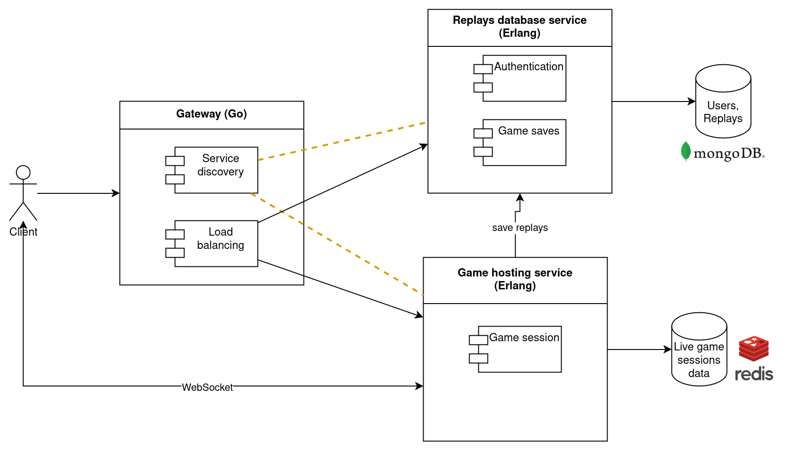

# Tetris server

This is a server for [my Tetris](https://github.com/shunlog/racket-tetris) desktop game. 

It aims to provide an online Tetris experience similar to [Jstris](https://jstris.jezevec10.com/) and [TETR.IO](https://tetr.io/). Two or more players start playing in a match and can see each other's field. They can send garbage lines to each other by clearing more lines at a time. As time passes, the difficulty increases and the pieces start falling faster. The player who lasts longer is the winner (or the one with a bigger score). The game replay is then saved and can be viewed by anyone online.

## Application Suitability Assessment

The idea of separating persistent data from live games into two different services is proven by [lichess.com](https://github.com/lichess-org/lila).
Lichess dedicates one service to handle the WebSocket connections for live games
and uses another service to store the user and replay files.
This way, the live games service can be scaled on multiple machines,
while a single data service may suffice.

A chess server and a Tetris server share many features related to this separation of concerns:
1. Both host live games which can have 2 players and many spectators
2. Both need to save game replays and share them
3. Both require authentication

Thus, the same approach for service boundaries should work well for Tetris.

Note the importance of scaling the live games service for the purpose of geographical distribution.
Tetris is a fast-paced game, so the latency is critical.

## Service boundaries

The **Replays database service**'s main purpose is to allow users to view replays of past games, or even host replays of their offline games (think of record breaking). For this, some sort of authentication is also required, which is handled in this same service.

Replays of online games might reference all the participants' profiles,
and you can query all the games played by a user.
It could also do rankings and statistics.

The **Game hosting service** is meant only for hosting games (duh). 
It creates the lobbies and lets users communicate with it via WebSockets.
People can also spectate a game while it's live.

This service does not have a persistent store.
After a game is over, this service could automatically save the replay on the Replays service, or it could simply send the replay file to the users and let them do whatever they wish with it.

This service might need to verify the identity of players (e.g. for private games, or to be able to save a replay automatically),
in which case maybe JWT would be a solution (to avoid querying the other service).

## Technology Stack and Communication Patterns

The APIs will accept HTTP requests with JSON bodies (mis-termed REST).

- **Replays database service**: Erlang + MongoDB
- **Game hosting service**: Erlang + Redis
- Gateway: Go

## Data Management 

### Replays database service

#### Authentication

- Sign up (login, password)
- Sign in (login, password) -> token

#### Replays

- Save replay (file)
- List replays (filter by date, players; sort by score, time)
- Get replay -> file

### Game hosting service

- Create lobby -> lobby_id
- List lobbies -> big list with lobby_id's and other data
- Join lobby (lobby_id, token?) -> WebSocket

Through the Websocket will be sent every action of the player (key presses and releases).
When someone joins a lobby that's already running, he will first receive all the past events to reconstruct the game state, and then will receive updates as they happen.

## Deployment & Scaling

Docker with Docker Compose.
